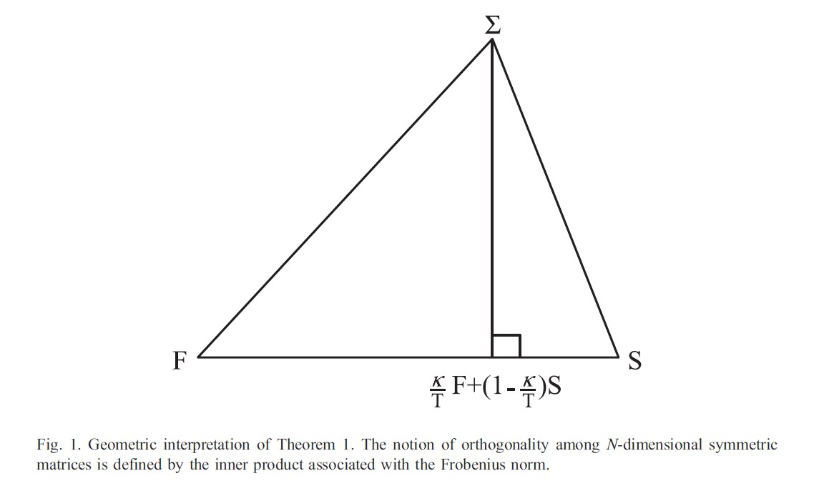
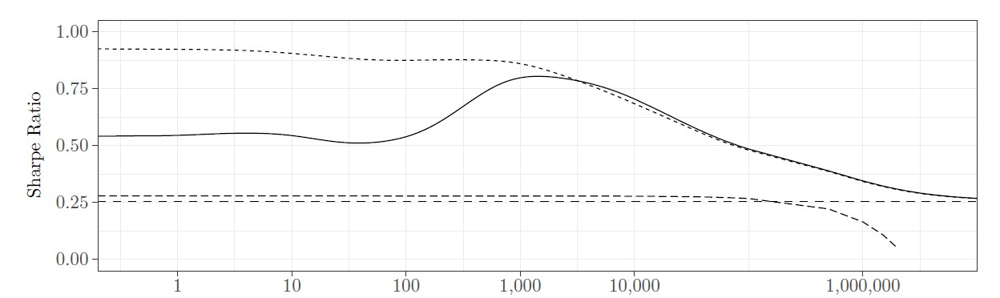
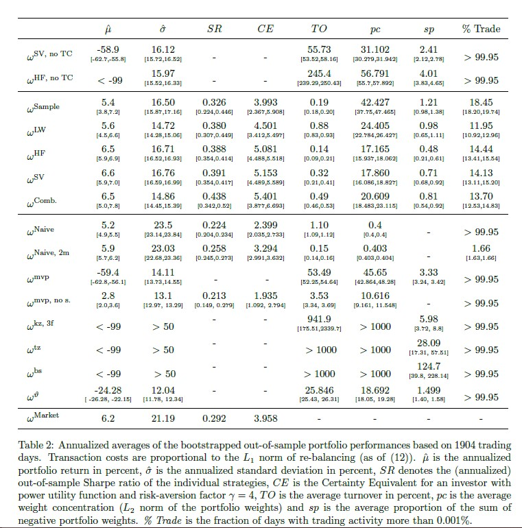

## Why do we care about volatility?

- Any time series can be decomposed into a predictable part and an unpredictable part
$$r_t = E\left(r_t|\mathcal{F}_{t-1}\right) + \varepsilon_t$$
where $\mathcal{F}_{t-1}$ denotes all information available at the end of day $t-1$

- In the last part of the lecture we focused on the conditional mean $\mu_t = E\left(r_t|\mathcal{F}_{t-1}\right)$
- This part: The conditional variance of $r_t$
$$\sigma_t^2 = \text{Var}\left(r_t|\mathcal{F}_{t-1}\right) = E\left(\varepsilon_t^2|\mathcal{F}_{t-1}\right)$$

- $\hat\sigma_t^2$ is a crucial component for *option pricing* - recall Black-Scholes
- $\hat\Sigma_t$ is relevant for the *portfolio choice problem*
- The core issue: $\sigma_t^2$ is not observable — at each date we only see one realization $r_t$, not the distribution it was drawn from

## What do we know about $\sigma_t^2$?

```{r}
#| label: load-industry-returns
#| echo: false
#| message: false

library(dplyr)
library(tidyr)

industry_returns <- tidyfinance::download_data_factors_ff("10 Industry Portfolios",
start_date = "2000-01-01", 
end_date = "2026-04-01")

returns <- industry_returns |> pivot_longer(-date, names_to = "industry", values_to = "return")
```

```{r}
#| label: plot-vol-clustering-acf
#| echo: false
library(ggplot2)
library(purrr)
theme_set(theme_minimal())

p0 <- ggplot(data = returns, mapping = aes(x = date, y = return, color = industry)) +
  geom_line(linewidth = 0.2) +
  scale_y_continuous(labels = scales::percent_format()) +
        labs(x = "Date", y = "Return (%)", title = "Volatility is not constant") +
        theme(legend.position = "none")

set.seed(3010)

p2 <- returns |>
  nest(.by = industry) |>
  mutate(
    acf = map(data, \(d) {
      with(acf(d$return^2, plot = FALSE), data.frame(lag, acf, n = nrow(d)))
    })
  ) |>
  select(-data) |>
  unnest(acf) |>
  filter(lag > 0) |>
  mutate(lag = as.numeric(lag) + runif(n(), -0.1, 0.1)) |> # add some jitter to the lags
  ggplot(aes(x = lag, y = acf, color = industry)) +
  geom_hline(aes(yintercept = 0)) +
  geom_hline(
    aes(yintercept = qnorm(0.975) / sqrt(n)),  # 95% CI bands
    linetype = "dashed", color = "blue"
  ) +
  geom_hline(
    aes(yintercept = -qnorm(0.975) / sqrt(n)),
    linetype = "dashed", color = "blue"
  ) +
  geom_segment(
    aes(xend = lag, yend = 0)) +
  labs(x = "Lag", y = "ACF of squared returns", title = "Volatility is predictable") +
  theme(legend.position = "none")

library(patchwork)
p0/p2
```

## Naive estimators

Simplest idea: a **rolling-window** sample variance over the last $M$ observations, where $M$ is the window length (e.g. $M=60$ for a 3-month daily window) and $\bar r_{t,M}$ is the sample mean over the same window:

$$\hat\sigma_{t}^2 = \frac{1}{M-1} \sum_{s=t-M+1}^{t} (r_s - \bar r_{t,M})^2$$

- The **cliff-edge problem:** when a large return exits the window, $\hat\sigma_t^2$ jumps even though no new information arrived today
- The bias-variance tradeoff: short $M$ reacts fast but is noisy; long $M$ is smooth but stale

The **RiskMetrics** estimator (J.P. Morgan 1994) with smoothing parameter $\lambda \in (0,1)$ (RiskMetrics default: $\lambda = 0.94$):

$$\hat\sigma_t^2 = (1 - \lambda)\, r_{t-1}^2 + \lambda\, \hat\sigma_{t-1}^2$$

- No cliff-edge: all past returns are included with exponentially declining weights

## Naive estimators
```{r}
#| label: compute-naive-vol-estimators
#| echo: false
#| message: false
#| warning: false
ewma_vol <- function(ret, lambda = 0.94) {
  n <- length(ret)
  sigma2 <- numeric(n)
  sigma2[1] <- ret[1]^2
  for (t in 2:n) {
    sigma2[t] <- (1 - lambda) * ret[t-1]^2 + lambda * sigma2[t-1]
  }
  sqrt(sigma2)
}

naive_estimators <- returns |>
  filter(industry == "manuf") |>
  arrange(date) |>
  mutate(
    `Rolling 1Y`  = slider::slide_dbl(return, sd, .before = 12, .complete = TRUE),
    `Rolling 5Y`  = slider::slide_dbl(return, sd, .before = 60, .complete = TRUE),
    `EWMA (λ=0.94)` = ewma_vol(return, lambda = 0.94)
  ) |>
  select(date, `Rolling 1Y`, `Rolling 5Y`, `EWMA (λ=0.94)`) |>
  pivot_longer(-date, names_to = "estimator", values_to = "sigma")

ggplot(naive_estimators, aes(x = date, y = sigma, color = estimator)) +
  geom_line(linewidth = 0.3) +
  labs(x = NULL, y = "Estimated volatility",
       title = "Naive volatility estimators (Manufacturing industry)",
       color = NULL) +
  theme(legend.position = "bottom")
```

## Conditional Heteroscedastic Models

 - The manner under which $\sigma_t^2$ evolves over time distinguishes one volatility model from another
 - I will focus on conditional heteroscedastic models that use an exact function to govern the evolution of $\sigma_t^2$, but there are also models with stochastic components (stochastic volatility)
 
 1. ARCH (autoregressive conditional heteroscedasticity)
 2. GARCH (generalized ARCH)
 
## Volatility model building^[Consult Tsay (2010) for a textbook treatment]

Building a volatility model for an asset return series consists of four steps:

1. Specify a mean equation (e.g., multi-factor model) or test for serial dependence in the data and, if necessary, build an econometric model (e.g., an ARMA model) for the return series to remove any linear dependence 
2. Use the residuals of the mean equation to test for autoregressive conditional heteroskedasticity (ARCH) effects
3. Specify a volatility model if ARCH effects are statistically significant, and perform a joint estimation of the mean and volatility equations
4. Check the fitted model carefully and refine it if necessary

## The ARCH model (Engle, 1982)

- An ARCH(m) model describes the dependence of $\varepsilon_t$ by
$$\varepsilon_t = \sigma_t z_t \qquad \sigma_t^2 = \alpha_0 + \alpha_1 \varepsilon_{t-1}^2 + \ldots + \alpha_m \varepsilon_{t-m}^2$$
- where $z_t$ is a sequence of independent and identically distributed (iid) random variables with mean zero and unit variance 
- (common assumption for MLE: Gaussian or t-distributed $z_t$)
- Intuition: large past shocks $\varepsilon_{t-1}^2$ imply higher conditional variance (clustering)

**Parameter considerations:**

- The sequence of parameters $\alpha_i$ must satisfy some conditions to guarantee positivity of $\sigma_t^2$: $\alpha_0 \geq0$, and $\alpha_i >0 \forall i> 0$ 
- The coefficients $\alpha_i$ must satisfy some regularity conditions to ensure that the unconditional
variance of $\varepsilon_t$ is finite / $\sigma_t^2$ is stationary (all roots in $k$ of $1 - \alpha_1 k - \ldots - \alpha_m k^m = 0$ lie outside the unit circle)
- The unconditional variance is given by $\sigma_\varepsilon^2 = \frac{\alpha_0}{1 - \sum_{i=1}^m\alpha_i}$ 

## The GARCH model (Bollerslev, 1986)

- Problem of the ARCH model: typical financial time series often require highly parameterized ARCH models
- The GARCH(p,q) model is given by 
$$\varepsilon_t  = \sigma_t z_t \qquad \sigma_t^2 = \alpha_0 + \sum\limits_{j=1}^p\alpha_j \varepsilon_{t-j}^2 + \mathbf{\sum\limits_{i=1}^q\beta_i \sigma_{t-i}^2}$$
- Any stationary GARCH(p,q) model can be written as an ARCH($\infty$) model

**Parameter considerations:**

- Positive $\sigma_t^2$ is ensured by $\alpha_0\geq 0, \alpha_j\geq0, \beta_i\geq0$
- Similar conditions for stationarity as for ARCH: all roots in $k$ of $1 - \alpha_1 k - \ldots - \alpha_p k^p - \beta_1 k - \ldots - \beta_q k^q = 0$ lie outside the unit circle

## Forecasting
- Consider a GARCH(1, 1) model
- At time $t$, the 1-step ahead forecast is
$$\sigma_t^2(1) = E(\sigma_{t+1}^2|\mathcal{F}_t) = \alpha_0 + \alpha_1\varepsilon_t^2 + \beta_1\sigma_t^2$$
- Note: You can rewrite the GARCH(1, 1) equation with $z_t = \varepsilon_t/\sigma_t$ as
$$\sigma_{t+1}^2 = \alpha_0 + \alpha_1\sigma_t^2z_t^2 + \beta_1\sigma_t^2 = \alpha_0 + (\alpha_1 + \beta_1)\sigma_t^2 + \alpha_1\sigma_t^2(z_t^2 -1)$$
- Taking expectations at time $t$ and using $E(z_t^2 - 1)=0$ gives the 2-step forecast
$$\sigma_t^2(2) = \alpha_0 + (\alpha_1 + \beta_1)\sigma_t^2(1)$$
- Iterating, the $l$-step ahead forecast satisfies
$$\sigma_t^2(l) = E(\sigma_{t+l}^2|\mathcal{F}_t) = \alpha_0 + (\alpha_1 + \beta_1)\sigma_t^2(l-1)$$
- For $l\rightarrow\infty$
$$\sigma_t^2(l) \rightarrow \frac{\alpha_0}{1 - \alpha_1 - \beta_1}$$

## Forecasting: illustration

- **Intuition:** volatility forecasts decay geometrically toward the unconditional variance $\bar\sigma^2 = \alpha_0/(1-\alpha_1-\beta_1)$ at rate $\alpha_1 + \beta_1$ — today's volatility shock matters most for the near future and vanishes as the horizon grows

```{r}
#| label: plot-garch-forecast-mean-reversion
#| echo: false
#| message: false
#| warning: false
alpha0 <- 0.02
alpha1 <- 0.09
beta1  <- 0.88
long_run <- alpha0 / (1 - alpha1 - beta1)

forecast_path <- function(sigma2_today, horizon) {
  s2 <- numeric(horizon)
  s2[1] <- alpha0 + (alpha1 + beta1) * sigma2_today
  for (l in 2:horizon) s2[l] <- alpha0 + (alpha1 + beta1) * s2[l - 1]
  s2
}

horizon <- 120
paths <- tibble(
  l = rep(1:horizon, 2),
  sigma2 = c(forecast_path(4 * long_run, horizon),
             forecast_path(0.25 * long_run, horizon)),
  start = rep(c("High volatility start", "Low volatility start"), each = horizon)
)

ggplot(paths, aes(x = l, y = sqrt(sigma2), color = start)) +
  geom_line(linewidth = 0.6) +
  geom_hline(yintercept = sqrt(long_run), linetype = "dashed") +
  labs(x = "Forecast horizon l (days)", y = expression(sigma[t](l)),
       title = "GARCH(1,1) forecasts mean-revert to the unconditional level",
       color = NULL) +
  theme(legend.position = "bottom")
```

## Model estimation

- Log likelihood function under the normality assumption for $\varepsilon_t$
$$\begin{aligned}\log \mathcal{L}\left(\theta\right) &= \log f\left(r_1|\theta\right) + \log f\left(r_2|r_1, \theta\right) + \ldots + \log f\left(r_T|r_{t-1}, \ldots, r_1, \theta\right)\\ &=-\frac{T}{2}\log(2\pi)-\sum\limits_{t=1}^T\left(\log(\sigma_t^2) + \frac{(r_t - \mu_t)^2}{2\sigma_t^2}\right)\end{aligned}$$
where $\sigma_t^2$ and $\mu_t$ are computed recursively
- Similar of course for different likelihood specifications, e.g. student $t$ (consult Tsay (2010) for specific estimation issues)

- Consult the exercises for hands-on examples 

1. Define (negative) log-likelihood function 
2. Use `optim` (R) or `minimize` (Python) to find maximum likelihood estimator (in some cases, constrained optimization is required)
3. Retrieve information matrix (`hessian = TRUE` (R) or (`hess_inv` (Python))
4. Compute standard errors 
```{r}
#| label: mle-standard-errors-snippet
#| eval: false
#R
fit <- optim( ... ) # fitted mle object 
sqrt(diag(solve(fit$hessian)))
```

## Fitting GARCH in Practice

`tsgarch` (Galanos) is the modern R package for GARCH estimation.

The key choice is the **distribution** of the innovations $z_t$: a skewed Student-$t$ captures fat tails and asymmetry, while a plain Gaussian likelihood yields consistent parameter estimates but requires robust standard errors for inference.

::: {.panel-tabset group="language"}
## R
```{r}
#| label: fit-garch-tsgarch
#| message: false
#| warning: false
#| results: hide
returns_xts <- returns |> filter(industry == "manuf") |>
  as.data.frame() |>
  (\(d) xts::xts(d[, "return"], order.by = d[["date"]]))()
library(tsgarch)
spec <- garch_modelspec(
  y            = returns_xts,
  model        = "garch",
  order        = c(1, 1),
  distribution = "sstd"
)

fit <- estimate(spec)
summary(fit)
```

## Python
```{python}
#| eval: false
from arch import arch_model

model = arch_model(
    returns["manuf"],
    vol="Garch", p=1, q=1,
    dist="skewt", mean="Zero"
)
result = model.fit(disp="off")
print(result.summary())
```
:::

## Value-at-risk: definition

- The VaR (Value-at-risk) of a financial position over a given time horizon $l$ with tail
probability $p$ is defined by $$p = \text{Pr}\left(L(l) \geq VaR\right) = 1 - \text{Pr}\left(L(l) \leq VaR\right)$$
where $L$ is a loss function, e.g. in terms of USD
- Intuition: the probability that the position holder would encounter a loss greater than or equal to VaR over the time horizon $l$ is at most $p$

```{r}
#| label: plot-gaussian-loss-cdf
#| echo: false
#| fig-height: 3
#| fig-width: 6
#| fig-align: center

data = tibble(loss = seq(from = -10, to = 10, by  = 0.1),
       cdf = pnorm(loss, mean = 1, sd = 4))
data |>
  ggplot(aes(x = loss, 
             y = cdf)) +
  geom_line() +
  geom_ribbon(data = data |> filter(loss < 2 - 4 * 1.96),
              aes(ymin = 0, ymax = cdf), fill = "lightblue", alpha = 0.5) +
  labs(title = "CDF of Gaussian Loss",
       x = "Loss",
       y = NULL) +
  geom_vline(aes(xintercept = 2 - 4 * 1.96),linetype = "dotted")
```

## Small example: Value-at-risk
```{r}
#| label: plot-garch-var-vs-returns
#| echo: false
library(xts)

# assuming normal distribution; adjust qnorm to qt(..., df) for t-distributed errors
var_95 <- qnorm(0.05) * as.numeric(fit$sigma)

tibble(
  date   = index(fit$sigma),
  sigma  = as.numeric(fit$sigma),
  var_95 = var_95,
  return = as.numeric(returns_xts)
) |>
  ggplot(aes(x = date)) +
  geom_line(aes(y = return), alpha = 0.4) +
  geom_line(aes(y = var_95), color = "red") +
  geom_line(aes(y = -var_95), color = "red", linetype = "dashed") +
  labs(y = NULL, title = "Returns vs. 95% VaR")
```

# Multivariate volatility estimation
## Multivariate volatility estimation

- Covariances are relevant for portfolio theory (and therefore asset pricing, capital budgeting, investment decisions) 
- Requires estimation of $\Sigma_t$ instead of just $\sigma_t^2$

**Problems for estimates $\hat\Sigma_t$:**

1. The curse of dimensionality (too many parameters)
2. Time variation (volatilities and correlations may change over time)
3. Frequency (minute, daily, monthly data?)

**Discuss: How would you compute minimum variance portfolio weights for a universe of 1000 assets?**

## General Framework

- We consider the $N$-dimensional return series
$$r_t = E\left(r_t|\mathcal{F}_t\right) + \varepsilon_t$$
where $\varepsilon_t$ is a $(N\times 1)$ vector of error terms with (conditional) covariance matrix $\Sigma_t$
- Exploiting the symmetry property of $\Sigma_t$ we can write 
$$\Sigma_t = D_tQ_tD_t$$
where $Q_t$ is the $(N\times N)$ conditional correlation matrix of $\varepsilon_t$ and $D_t = \text{diag}\left({\sigma_{11, t}}, \ldots, {\sigma_{NN, t}}\right)$ is a $(N \times N)$ diagonal matrix 
- Because of the symmetry of $\Sigma_t$, it is sufficient to consider only $N(N+1)/2$ unique elements

## The curse of dimensionality

- Consider the case with a $(T \times N)$ matrix of returns $R$ where $T<N$
- Then the sample variance covariance matrix is $$S = \frac{1}{T-1}R'\left(I_T - \frac{1}{T}\iota\iota'\right)R$$
- The rank of the matrix $R'R$ is $\min(T, N) = T$ 
- (intuition:  $R'R$ qua linear transformation sends $\mathbb{R}^N$ into a subspace with dimension at most $T$)
- This implies that $R'R$ is singular for $N\geq T$ and thus
$$\exists w\in\mathbb{R}^N: w'Sw = 0$$
- In other words, $S$ is not invertible and there is no unique efficient portfolio
- More structure is required to overcome this issue (e.g. based on factor structure)

## Linear shrinkage (Ledoit Wolf, 2003, 2004)

- The sample covariance matrix is unbiased and the maximum likelihood estimator under normality
- In the context of mean estimation, Stein (1956) showed that a better estimator than the sample mean can be constructed by
shrinking the sample mean to a target vector, that is, by using a linear combination of the
sample mean and the target vector
- Better in the sense of the mean squared error (MSE) — a little bias in exchange for a large reduction in variance
- Ledoit and Wolf (2003, 2004) apply the same thinking to $\Sigma$
- They suggest a linear combination of some target matrix $F$ (identity, single factor, or equicorrelation matrix) and the sample variance-covariance matrix $\hat\Sigma$, controlled by the *shrinkage intensity* $\alpha$:
$$\hat\Sigma^{LW} = \alpha F + (1-\alpha) \hat\Sigma \text{ for } 0\leq\alpha\leq1$$

The shrinkage target (Ledoit Wolf, 2004)

- We already discussed (multi) factor models
- Constant correlation model: all the (pairwise) correlations are assumed identical. 
- Estimator of the common constant correlation: average of all the sample correlations 


## Illustrating shrinkage 

```{r}
#| label: fig-ledoit-wolf-shrinkage
#| echo: false

```

- The optimal linear combination depends on unknown population quantities and must, therefore, be thought of as an ideal (or “oracle”) but infeasible estimator
- Ledoit and Wolf derive feasible estimators (in an exercise you are asked to implement the estimator)

## The optimal shrinkage intensity (Ledoit-Wolf 2003, 2004)

- To define the MSE for an $(N\times N)$ matrix $A$, we use the Frobenius norm
$$||A||^2_F = {<A, A>} := \frac{1}{N}\sum\limits_{i=1}^N\sum\limits_{j=1}^N A_{i,j}^2 = \frac{1}{N}tr(A'A)$$
- The scaled mean squared error is
$$E\left(||\Sigma^{LW} - \Sigma||_F^2\right) \text{ where } \Sigma^{LW} = \alpha F + (1-\alpha) \hat\Sigma$$
 - Let $\pi$ be the sum of asymptotic variances of the entries of the sample covariance matrix scaled by $\sqrt{T}$, $\rho$ the scaled asymptotic covariances of the entries of the single-index covariance, and $\psi$ the bias (misspecification) of the target
 $$\alpha^* = \frac{1}{T}\frac{\pi - \rho}{\psi}$$

- **Interpretation:** shrink *more* when sample noise $\pi$ is large (high-dimensional, short sample) and *less* when the target is badly misspecified ($\psi$ large). The factor $1/T$ ensures that as the sample grows, the optimal shrinkage vanishes and the estimator collapses to $\hat\Sigma$

## Dynamic multivariate models

- The generalization of univariate GARCH models to the multivariate domain is conceptually simple
- The literature on the dynamics governing $\Sigma_t$ may be broadly divided into direct multivariate extensions, factor models, linear combinations of univariate GARCH models (Generalized Orthogonal GARCH), and nonlinear combinations of univariate GARCH models (the broader class of Dynamic Correlation models)
- The need to invert the covariance matrix in many MGARCH parameterizations introduces estimation problems for large systems, as the eigenvalues of the covariance matrix decrease exponentially fast toward zero, even when the covariance is not singular

## Constant conditional correlation (CCC)

- Bollerslev (1990)
- In the constant conditional correlation (CCC) model of Bollerslev (1990), the covariance matrix can be decomposed
into
$$\Sigma_t = D_tRD_t = \rho_{ij}\sqrt{h_{ijt}h_{ijt}}$$
where $D_t = \text{diag}(\sqrt{h_{11t}}, \ldots, \sqrt{h_{NNt}})$ and $R$ is a positive definite correlation matrix
- Maximum likelihood estimation possible in the multivariate normal case (see Eq. 50 in Boudt et al., 2019)

## Obvious extension: DCC
- Covariance Targeting (Engle (2002))
$$\Sigma_t = D_t\mathbf{R_t}D_t = \rho_{ij}\sqrt{h_{ijt}h_{ijt}}$$
- DCC is a **two-step estimator**: (i) fit a univariate GARCH to each asset to obtain $D_t$ and the standardized residuals $z_t = D_t^{-1}\varepsilon_t$; (ii) model the dynamics of the correlation matrix using a proxy process $Q_t$:
$$Q_t = \bar{Q} + \alpha\left(z_tz_t' - \bar{Q}\right) + \beta\left({Q}_{t-1} - \bar{Q} \right)$$
where $\bar Q$ is the sample covariance of the $z_t$ and $(\alpha, \beta)$ are scalar parameters governing the correlation dynamics
- The correlation matrix $R_t$ is then obtained as
$$R_t = \text{diag}(Q_t)^{-1/2}Q_t\text{diag}(Q_t)^{-1/2}$$

# Large-scale portfolio allocation under model uncertainty and transaction costs

## Bridging to large-scale allocation

- At time $t$, we solve the problem
$$ \begin{array}{c}
   \max_{\omega_{t+1}} \: \omega_{t+1}'\mu_t -\frac{\gamma}{2} \omega_{t+1}'\,\Sigma_{t}\, \omega_{t+1} \quad
    s.t. \quad \omega'_{t+1}\;\iota= 1,
   \end{array}$$
where $\Sigma_{t}$ denotes the $N\times N$ asset return covariance, $\mu_t$ the mean vector, $\gamma$ the relative risk aversion, and $\iota$ a vector of ones

- Optimal portfolio weights:
$$\begin{aligned}
 \omega^*_{t+1} & = \frac{1}{\iota' \Sigma_t^{-1} \iota }\Sigma_t^{-1} \iota+\frac{1}{\gamma}\left(\Sigma_t^{-1} - \frac{1}{\iota' \Sigma_t^{-1}\iota }\Sigma_t^{-1}\iota\iota' \Sigma_t^{-1} \right) \mu_t
 \end{aligned}$$


## ... the classical problem

- Noisy estimates of $\mu_t$ over short horizons
- Solution (?): Fixing $\mu_t$ (e.g. $\mu_t=0$) or using long horizons
- ($N \times N$) matrix $\Sigma_t$ contains $N(N-1)/2$ distinct elements $\Rightarrow$ Estimation error
- For $N=500$: 124,750 elements
- Sample covariance only positive definite if $T\ge N$

$\Rightarrow$ Plugging in sample estimates $\hat \mu_t$ and $\hat \Sigma_t$ performs badly!

## Solution: Regularizing $\Sigma$ ...

- Shrinking the covariance matrix (Ledoit and Wolf, 2004):
$$\begin{aligned}
\Sigma_t= \hat{\alpha}F_t+(1-\hat{\alpha})S_t,
\end{aligned}
$$
where $S_t$ is the sample variance-covariance matrix and $F_t$ denotes the equi-correlation matrix

**Alternative approaches:**
- Restricting portfolio weights (*Jagannathan and Ma, 2003*; Fan et al, 2012)
- Factor models (MacKinlay Pastor, 2000; Fan et al, 2008)
- Parsimonious high-dimensional parametric volatility models (Engle Ledoit Wolf, 2017)
- Imposing priors (Barry, 1974; Brown, 1979; Jorion, 1985, 1986; Black Litterman, 1992; Pastor Stambaugh, 2000)

**... or using high-frequency data:**

- Idea: Constructing a daily covariance estimate using HF data of the same day
- E.g., Liu (2009), Hautsch et al (2012), Hautsch et al (2015), Lunde et al (2015), Bollerslev et al (2016), ...

## But ...

**Frictions:**

- No consideration of transaction costs!
- Re-balancing is costly!

**Estimation:**

- Parameters are uncertain!
- Model ambiguity
- Predictive ability of models is time-varying!

- De Miguel et al (2009): Out of sample, the $1/N$ portfolio cannot be outperformed in high dimensions!

## Portfolio optimization under transaction costs

The investor at time $t$ observes past returns $R_t=\left(r'_{1},\ldots,r'_{t}\right)'\in\mathbb{R}^{t \times N}$ and assumes an underlying (predictive) model $\mathcal{M}$.

The (myopic) portfolio optimization problem is
$$\begin{aligned}
\omega_{t+1} ^* :=&\arg\max_{\omega\in\mathbb{R}^N,  \iota'\omega=1} E\left(U_\gamma\left(\omega ' \left(1 + {r}_{t+1}\right)-\nu_t (\omega)\right)|\mathcal{M}, \mathcal{F}_t\right) \\
=&\arg\max_{\omega\in\mathbb{R}^N,  \iota'\omega=1} \int U_\gamma\left(\omega '\left(1 + {r}_{t+1}\right)-\nu_t(\omega) \right) p_t ({r}_{t+1}|\mathcal{M})\,\text{d}{r}_{t+1},
\end{aligned}$$
where $p_t({r}_{t+1}|\mathcal{M}):=p_t({r}_{t+1}|\mathcal{M}, \mathcal{F}_t)$ denotes the predictive return distribution and $\nu_t(\omega)$ the transaction costs.

## A closed-form solution for Gaussian returns and quadratic transaction costs

- Initial Markowitz (1952) approach with Gaussian returns: $p_t({r}_{t+1}|\mathcal{M})=N(\mu,\Sigma)$
- Can be solved by maximizing the certainty equivalent
$$\begin{aligned}
\omega_{t+1} ^* & = \arg\max_{\omega \in \mathbb{R}^N,  \iota'\omega = 1} \omega'\mu - \nu_t \left(\omega\right) - \frac{\gamma}{2}\omega'\Sigma\omega.
\end{aligned}$$
- We assume **quadratic** transaction costs — mainly because they yield a closed-form solution that is directly comparable to the classical Markowitz problem (Hautsch et al. 2019 show that the $L_1$ case can be treated similarly):
$$\begin{aligned}
\nu\left(\omega_{t+1},\omega_{t^+}, \beta\right) = \frac{\beta}{2} \left(\omega_{t+1} - \omega_{t^+}\right)'\left(\omega_{t+1}- \omega_{t^+}\right),
\end{aligned}$$
with cost parameter $\beta>0$
- The pre-rebalancing weights $\omega_{t^+}$ are *not* the same as yesterday's target weights $\omega_t$: even if the investor does nothing, prices move during the day and drift the portfolio away from $\omega_t$. Concretely:
$$\omega_{t^+} := \frac{\omega_t \circ (1 + r_{t})}{\iota' (\omega_t \circ (1 + r_{t}))}$$

## Optimization problem^[All proofs can be found in Hautsch et al (2020)]
- Proof left for exercise
$$\begin{aligned}
\omega_{t+1} ^* :=&  \arg\max_{\omega \in \mathbb{R}^N,  \iota'\omega = 1} \omega'\mu - \nu_t (\omega,\omega_{t^+}, \beta) - \frac{\gamma}{2}\omega'\Sigma\omega \\
=&\arg\max_{\omega\in\mathbb{R}^N,\text{ }  \iota'\omega=1}
\omega'\mu^* - \frac{\gamma}{2}\omega'\Sigma^* \omega ,
\end{aligned}$$
where the effective mean and covariance absorb the transaction-cost terms:
$$\begin{aligned}
\mu^*:=\mu+\beta \omega_{t^+} \quad  \text{and} \quad \Sigma^*:=\Sigma + \frac{\beta}{\gamma} I_N
\end{aligned}$$
- As a result: $$\begin{aligned}
 \omega^*_{t+1} & = \frac{1}{\gamma}\left(\Sigma^{*-1} - \frac{1}{\iota' \Sigma^{*-1}\iota }\Sigma^{*-1}\iota\iota' \Sigma^{*-1} \right) \mu^*  + \frac{1}{\iota' \Sigma^{*-1} \iota }\Sigma^{*-1} \iota\end{aligned}$$

## What happens if $\beta\rightarrow \infty$?

- Define $A(\Sigma):=\left({\Sigma}^{-1} - \frac{1}{\iota' {\Sigma}^{-1}\iota }{\Sigma}^{-1}\iota\iota' {\Sigma}^{-1} \right)$.
- Proposition. Let $\omega_0$ be the initial allocation. Then,
$$\begin{aligned}
\omega_T^*  = \sum\limits_{i=0}^{T-1}\left( \frac{\beta}{\gamma}A(\Sigma^*)\right) ^i \omega(\mu,\Sigma^*) + \left(\frac{\beta}{\gamma}A(\Sigma^*)\right)^T \omega_0,
\end{aligned}$$
where $\omega(\mu,\Sigma^*)$ denotes the mean-variance efficient allocation.
- Proposition.
$$
\begin{aligned}
\lim_{\beta\rightarrow\infty}\omega_{t+1}^*
&= \left(I_N - \frac{1}{N}\iota \iota' \right) \omega_{t^+}  + \frac{1}{N}\iota = \omega_{t^+}
\end{aligned}$$

## Efficiency of the portfolio
- Proposition.
$\exists \beta^*> 0 \text{ } \forall \tilde{\beta}\in [0,\beta^*): \left\|\left(\frac{\tilde\beta}{\gamma}A(\Sigma^*)\right)\right\|_F < 1$, where $\|\cdot\|_F$ denotes the Frobenius norm $\|A\|_F := \sqrt{\sum\limits_{i=1}^N\sum\limits_{j=1}^N a_{i,j}^2}$
- For $\beta < \beta^*$ and $T \rightarrow \infty$, we have
$$\begin{aligned}
\sum_{i=0}^{T}\left( \frac{\beta}{\gamma}A(\Sigma^*)\right) ^i \rightarrow  \left(I_N - \frac{\beta}{\gamma}A(\Sigma^*)\right)^{-1}
\end{aligned}$$
and $\lim_{i\rightarrow\infty}\left( \frac{\beta}{\gamma}A(\Sigma^*)\right) ^i = 0$.
- Proposition. For $T\rightarrow \infty$ and $\beta < \beta^{*}$ the series $\omega_T$ converges to a unique fix-point given by
$$\begin{aligned}
\omega_\infty & = \left(I_N - \frac{\beta}{\gamma}A(\Sigma^*)\right)^{-1} \omega(\mu,\Sigma^*) = \omega(\mu, \Sigma)
\end{aligned}$$

## Intuition behind shrinkage
- For asset-specific transaction costs
$$\left(\omega_{t+1} - \omega_{t^+}\right)'B\left(\omega_{t+1}- \omega_{t^+}\right)$$
	where $B$ is positive definite, the linear shrinkage estimator for $\Sigma$ of Ledoit and Wolf (2003, 2004) can be reconciled.
- Lemma. Assume a regime of high volatility with $\Sigma^h = (1 + h)\Sigma$, where $h > 0$ and $\Sigma$ is the asset return covariance matrix during calm periods. Assume $\mu=0$. Then, the optimal weight $\omega_{t+1}^*$  is
	equivalent to the optimal portfolio based on $\Sigma$ and (reduced) transaction costs $\frac{\beta}{1+h} < \beta.$

## Empirical Illustration

- $N=308$ assets; 06/2007 - 03/2017 with daily readjustments
- $\Sigma_t$ estimated by

  1. Sample covariance
  1. Ledoit/Wolf (2004) shrinkage estimator
  1. Rolling window of length $h = 500$ days

- $\mu_t$ is fixed to zero. Initial portfolio weights: $\frac{1}{N}\iota$. $\gamma=4$.
- Yields realized portfolio returns net of transaction costs
$$\begin{aligned}
r^\beta_t - \beta \left(\omega^\beta_{t+1} - \omega^\beta_{t^+}\right)^\prime\left(\omega^\beta_{t+1} - \omega^\beta_{t^+}\right)
\end{aligned}$$
 with $r^\beta_t := r_t ^\prime \omega_t^\beta$.

## Realized Sharpe ratios with quadratic transaction costs



- Sample (solid line), LW (dotted line), Equal (dashed) 
- X-axis denotes transaction cost parameter $\beta$ in basis points

## $L_1$ Transaction Costs

- Usual assumption in the literature: $L_1$ transaction costs
$$\begin{aligned}
\nu_t\left(\omega, \omega_{t^+}, \beta\right)=\beta ||\omega-\omega_{t^+}||_1 = \beta \sum_{i=1}^N |\omega_{i,t+1}-\omega_{i,t^+}|.
\end{aligned}$$

- For $\mu=0$ and $\Delta:=\omega_{t+1}-\omega_{t^+}$, we have
$$\begin{aligned}
\omega_{t+1} ^* = \arg\min_{\Delta\in\mathbb{R}^N,\text{ }  \iota'\Delta=0}
\gamma\Delta'\Sigma\omega_{t^+} + \frac{\gamma}{2}\Delta'\Sigma \Delta + \beta ||\Delta||_1,
\end{aligned}$$

- Solving for $\omega_{t+1}^*$ yields
$$\begin{aligned}
\omega_{t+1}^* =\left(1+\frac{\beta}{\gamma}\iota'\Sigma^{-1} \tilde g\right)\omega_\text{mvp} -\frac{\beta}{\gamma}\Sigma^{-1} \tilde g,
\end{aligned}$$
where $\tilde g$ is the vector of sub-derivatives of $||\omega_{t+1} - \omega_{t^+}||_1$ and $\omega_\text{mvp} := \frac{1}{\iota'\Sigma^{-1}\iota}\Sigma^{-1}\iota$ are the weights of the GMV portfolio.

## Recall Jagannathan and Ma?

- Proposition. For $\mu=0$, the underlying problem is equivalent to
$$\begin{aligned}
	\omega_{t+1} ^* = \arg\min_{\omega\in\mathbb{R}^N,\text{ }  \iota'\omega=1} \omega' \Sigma_{\frac{\beta}{\gamma}} \omega,
\end{aligned}$$
	where $\Sigma_{\frac{\beta}{\gamma}} = \Sigma + \frac{\beta}{\gamma}\left(g^*\iota' + \iota g^{*'}\right)$ and $g^*$ is the subgradient of $||\omega^*_{t+1}-\omega_{t^+}||_1$.


## What about parameter uncertainty? 
- Recall that the optimal portfolio (for now: $\nu = 0$) is computed as the solution to $$\begin{aligned}\small
\omega_{t+1} ^* :=&\arg\max_{\iota'\omega=1} E\left(U_\gamma\left(\omega ' \left(1 + {r}_{t+1}\right)\right)|\mathcal{M},\mathcal{F}_t\right) \\
=&  \arg\max_{\iota'\omega=1} \int U_\gamma\left(\omega '\left(1 + {r}_{t+1}\right) \right) p_t ({r}_{t+1}|\mathcal{M})\,\text{d}{r}_{t+1}\\
=&  \arg\max_{\iota'\omega=1} \int\int_\mu\int_\Sigma U_\gamma\left(\omega '\left(1 + {r}_{t+1}\right)\right)p_t ({r}_{t+1}|\mu, \Sigma, \mathcal{M})\,\text{d}\mu\,\text{d}\Sigma\,\text{d}{r}_{t+1},
\end{aligned}$$
where $p_t({r}_{t+1}|\mathcal{M}):=p_t({r}_{t+1}|\mathcal{M},\mathcal{F}_t)$ denotes the predictive return distribution

- Unlike the conditional distribution, the Bayesian predictive distribution accounts for estimation errors by integrating over the unknown parameter space
- The problem above refers to **Bayesian Portfolio Allocation**
1. Account for estimation risk and model uncertainty
2. Elicit economically meaningful prior beliefs about asset pricing models (distribution of future returns)
3. Highly flexible due to Bayesian computation techniques

## Bayesian asset allocation^[Consult Avramov and Zhou (2010)]

- So far we analysed a two-step procedure
1. Estimate the parameters $\hat\theta$ (e.g. $\hat\mu_t$ and $\hat\Sigma_t$)
2. Maximize the expected utility conditional on the estimated parameters being the true ones
$$\max_\omega = E\left(U(\omega)|\theta = \hat\theta\right)$$
- Optimally, however, the investor adjusts for estimation uncertainty
- Thus, portfolio selection based on $p_t ({r}_{t+1}|\mathcal{M})$ instead of $p_t ({r}_{t+1}|\hat\theta, \mathcal{M})$

## Example: Bayesian Portfolio Allocation 
- Specify the prior distribution of the parameters as diffuse  
$$\pi(\theta) = p(\mu_t|\Sigma_t) \times \pi(\Sigma_t) \propto |\Sigma_t|^{-\frac{N+1}{2}}$$
- Then, assuming that the returns are jointly normally distributed, 
the posterior distribution is given by $$p(\mu_t|\Sigma_t, \mathcal{D}_t) \propto |\Sigma_t|^{-1/2}\exp\left(-\frac{1}{2}tr\left(T(\mu_t - \hat\mu_t)\right)(\mu_t - \hat\mu_t)'\Sigma_t^{-1}\right)$$ and
$$\pi(\Sigma_t) \propto |\Sigma_t|^{-(T+N)/2}\exp\left(-\frac{1}{2}tr\Sigma_t^{-1}\left(T\hat\Sigma_t\right)\right)$$
- The predictive distribution corresponds to a multivariate $t$ distribution with $T - N$ degrees of freedom
- Under the diffuse prior the mean-variance efficient portfolio is
$$\omega^\text{Bayes} = \frac{1}{\gamma}\left(\frac{T - N - 2}{T + 1}\right)\hat\Sigma_t^{-1}\hat\mu_t$$
- Intuition: Invest less in the risky asset and more in the risk-free asset
 
## Extensions and takeaways
- Bayesian computation allows us to sample from (almost) arbitrary posterior predictive distributions
- Optimal allocation can be derived numerically
- Turnover regularization is closely related to parameter shrinkage
- Optimal portfolios are shifted towards current holdings
- This effect is different from *statistical* approaches: Shrinkage intensity is an exogenous parameter!

## Application: Hautsch and Voigt (2019)




# Parametric Portfolio Choice

## Stock characteristics and optimal portfolio choice

- Idea: parametrize weights as a function of the characteristics such that we maximize expected utility
- feasible for large portfolio dimensions (such as the entire CRSP universe)
- proposed by Brandt et al. (2009) in their influential paper *Parametric Portfolio Policies: Exploiting Characteristics in the Cross Section of Equity Returns*.

**Basic idea:**

- At each date $t$ we have $N_t$ stocks in the investment universe, where each stock $i$ has return $r_{i, t+1}$ and is associated with a vector of firm characteristics $x_{i, t}$ such as time-series momentum or market capitalization
- The investor's problem is to choose portfolio weights $w_{i,t}$ to maximize the expected utility of the portfolio return
$$\begin{aligned}
\max_{w} E_t\left(U(r_{p, t+1})\right) = E_t\left[U\left(\sum\limits_{i=1}^{N_t}w_{i,t}r_{i,t+1}\right)\right]
\end{aligned}$$

## Where do the stock characteristics show up? 

- Parametrize the optimal portfolio weights as a function of $x_{i,t}$ with the following linear specification for the portfolio weights:
$$w_{i,t} = \bar{w}_{i,t} + \frac{1}{N_t}\theta'\hat{x}_{i,t}$$ 
- here, $\bar{w}_{i,t}$ is the weight of a benchmark portfolio (value-weighted or naive portfolio), $\theta$ is a vector of coefficients which we are going to estimate, and $\hat{x}_{i,t}$ are the characteristics of stock $i$, cross-sectionally standardized to have zero mean and unit standard deviation. **Note on notation:** the hat on $\hat{x}_{i,t}$ denotes *standardization*, not an estimator — an unusual convention borrowed from Brandt et al. (2009)
- Think of the portfolio strategy as a form of active portfolio management relative to a performance benchmark: Deviations from the benchmark portfolio are derived from the individual stock characteristics 
- By construction the weights sum up to one as $\sum_{i=1}^{N_t}\hat{x}_{i,t} = 0$ due to the standardization. Note that the coefficients are constant across assets and through time
- Implicit assumption is that the characteristics fully capture all aspects of the joint distribution of returns that are relevant for forming optimal portfolios       

## Optimal Choice of $\theta$

- We estimate $\theta$ by replacing the expectation with its sample analogue and *maximizing the sample-average realized utility* of the implied portfolio returns:
$$\begin{aligned}
\hat\theta = \arg\max_\theta \frac{1}{T}\sum\limits_{t=0}^{T-1}U\left(\sum\limits_{i=1}^{N_t}\left(\bar{w}_{i,t} + \frac{1}{N_t}\theta'\hat{x}_{i,t}\right)r_{i,t+1}\right)
\end{aligned}$$
- In practice this is a low-dimensional numerical optimization (e.g. via `optim` in R) — the dimension of $\theta$ equals the number of characteristics, independent of $N_t$
- The allocation strategy is attractive because the number of parameters to estimate is small
- Instead of a tedious specification of the $N_t$-dimensional vector of expected returns and the $N_t(N_t+1)/2$ free elements of the variance-covariance matrix, all we need to focus on in our application is the vector $\theta$

**What about short-selling constraints?**

- Enforcing portfolio constraints via the parametrization is not straightforward, but in our case we simply renormalize the portfolio weights before returning them by computing
$$w_{i,t}^+ = \frac{\max(0, w_{i,t})}{\sum\limits_{j=1}^{N_t}\max(0, w_{j,t})}$$
